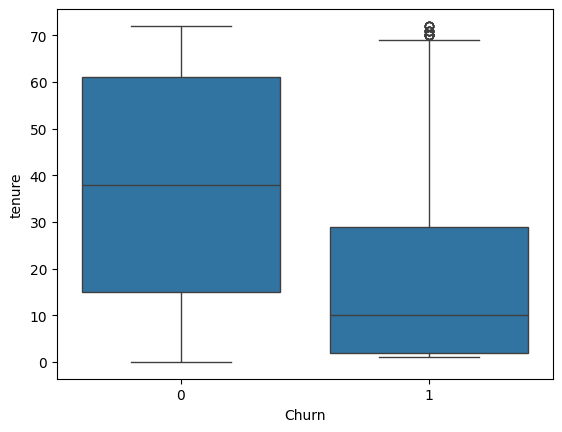
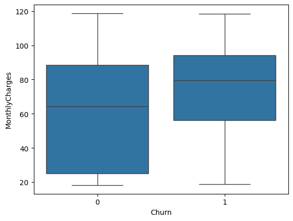
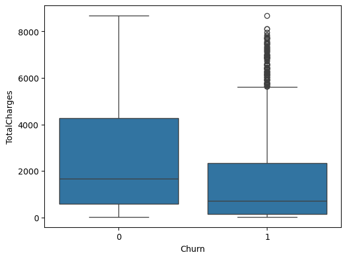

# 📊 Telco Customer Churn Prediction

## 📌 Overview

This project builds a machine learning model to predict customer churn using the Telco Customer Churn dataset.

The workflow includes:

* Data cleaning & preprocessing
* Exploratory Data Analysis (EDA)
* Feature engineering
* Baseline Logistic Regression
* Forward & Backward Feature Selection

---

## 📂 Dataset

* 7,043 customers
* 21 features
* Target variable: `Churn` (Yes/No → converted to 0/1)

---

## 🧹 Data Preprocessing

* Converted `TotalCharges` to numeric and handled missing values
* Dropped `customerID`
* One-hot encoded categorical features
* Scaled numerical variables
* Stratified train-test split

---

## 📊 Exploratory Data Analysis

### Key Observations:

* ~27% customers churned (moderate class imbalance)
* Low tenure customers churn more
* Month-to-month contracts have highest churn
* Electronic check users churn more
* Lack of Tech Support & Online Security increases churn

📌
📌
📌

---

## 🧠 Feature Engineering

* Created tenure groups (customer lifecycle segmentation)
* Engineered `num_services` feature
* Created `avg_monthly_spend`
* Ordinal encoded Contract type

---

## 🤖 Baseline Model

**Logistic Regression** used as baseline.

Evaluation metrics:

* ROC-AUC
* Precision
* Recall
* F1-score

Baseline ROC-AUC: ~0.83–0.85

              precision    recall  f1-score   support

           0       0.84      0.90      0.87      1035
           1       0.67      0.53      0.59       374

    accuracy                           0.81      1409
   macro avg       0.76      0.72      0.73      1409
weighted avg       0.80      0.81      0.80      1409

---

## 🔁 Feature Selection

* Forward Selection (ROC-AUC optimized)
* Backward Elimination
* Reduced feature set with similar or slightly improved performance

---

## 📌 Key Drivers of Churn

* Month-to-month contracts
* Low tenure
* High monthly charges
* No Tech Support
* No Online Security
* Electronic check payments

---

## 🚀 Next Steps

* Tree-based models (Random Forest, XGBoost)
* SHAP explainability
* Threshold optimization
* Hyperparameter tuning
